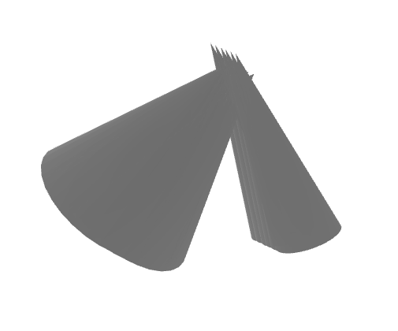
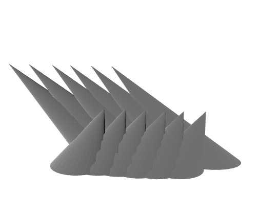
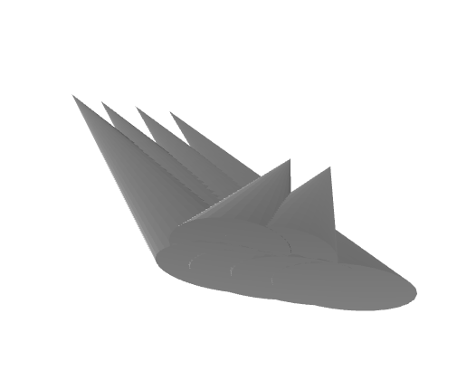
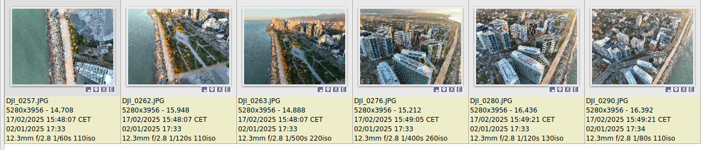
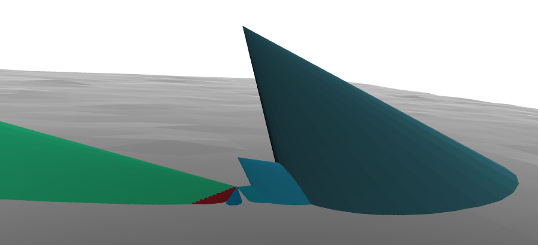
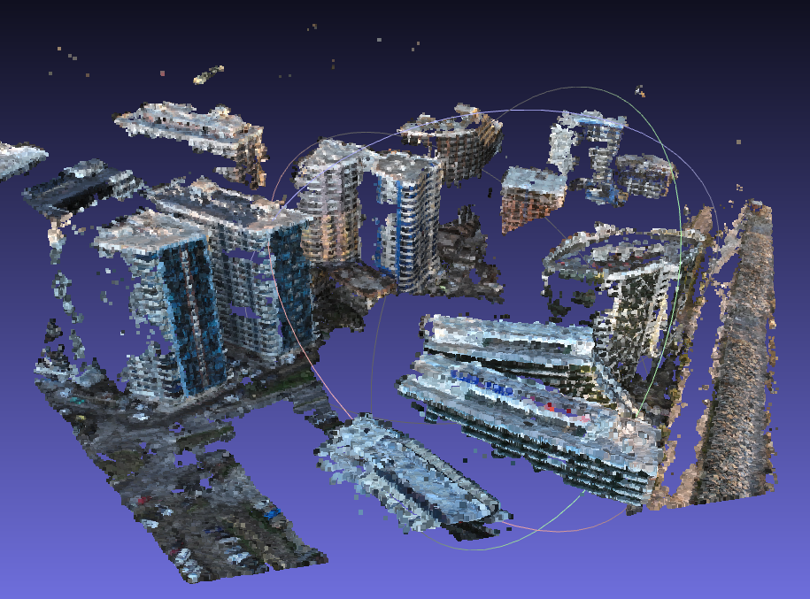

# Naive Algorithms for Improving Image Pairing in OpenSfM Using Cones, Boxes, and DEMs in Aerial Surveys

Each camera has a field of view (FOV) that can be approximated as a cone.

In aerial imaging, we capture the land surface from above. The intersection of the FOV cone with the terrain represents the region where image matches should be searched.

There are several global Digital Elevation Models (DEMs) available, such as SRTM and Copernicus. However, to enhance image pairing accuracy, our imagery must include global camera pose metadata.

#### Strategy:
- Generate field-of-view (FOV) cones for each camera.

- Clip the cones using the land surface (DEM) or a bounding box approximation.

- Identify overlapping FOV regions to determine potential image matches.

#### Code: 'cone_matcher.ipynb', test data: './data'.
If you run the code locally, you'll see many 3D visualizations in Jupyter, and temporary models can be viewed in MeshLab.

# Running with OpenSfM
1. Clone OpenSfM repo [git@github.com:mapillary/OpenSfM.git](https://github.com/mapillary/OpenSfM)
2. Checkout to commit 1106198c79a0417fe59df68293c59ba7688533c0 (19 Feb 2025 latest commit had unworking docker)
3. Build docker image with dockerfile from this repo
4. Run container with mounts similar to this way:

*docker run -it --rm --net host  \
--mount type=bind,source=/home/user/work/opensfm_dev,target=/source/OpenSfM  \
--mount type=bind,source=/home/user/work/opensfm_pairing_draft,target=/source/opensfm_pairing_draft  \
-e DISPLAY=$DISPLAY \
opensfm-base*

5. Run 'python3 setup.py build' inside OpenSfM folder
6. Install Jupyter-lab
7. Run notebook 'cone_pairing_opensfm.ipynb'

### Test reconstruction './opensfm_pairing_draft/data/batumi_6pic'

Pairing map:
- DJI_0280.JPG ['DJI_0276.JPG', 'DJI_0290.JPG']
- DJI_0263.JPG ['DJI_0262.JPG']
- DJI_0276.JPG ['DJI_0280.JPG', 'DJI_0257.JPG', 'DJI_0290.JPG']
- DJI_0257.JPG ['DJI_0276.JPG']
- DJI_0290.JPG ['DJI_0280.JPG', 'DJI_0276.JPG']
- DJI_0262.JPG ['DJI_0263.JPG']

Point cloud:

Left images can't be reconstructed, becouse they captured from the same point. Right images reconstructs correctly.